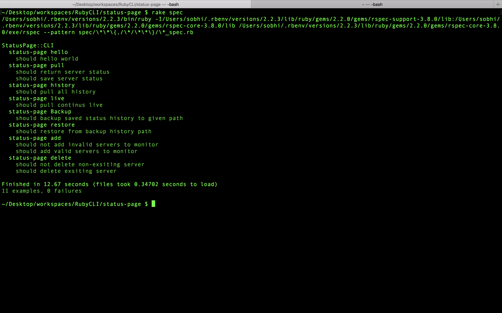
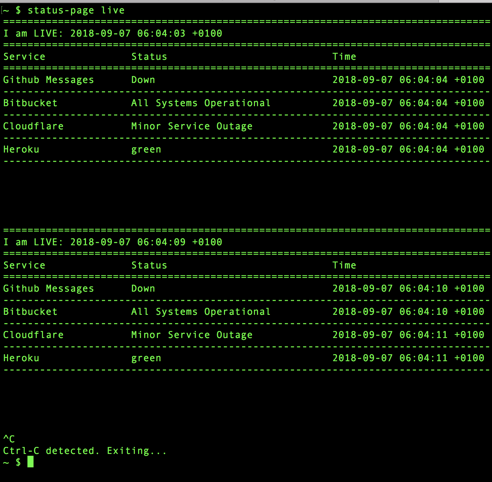
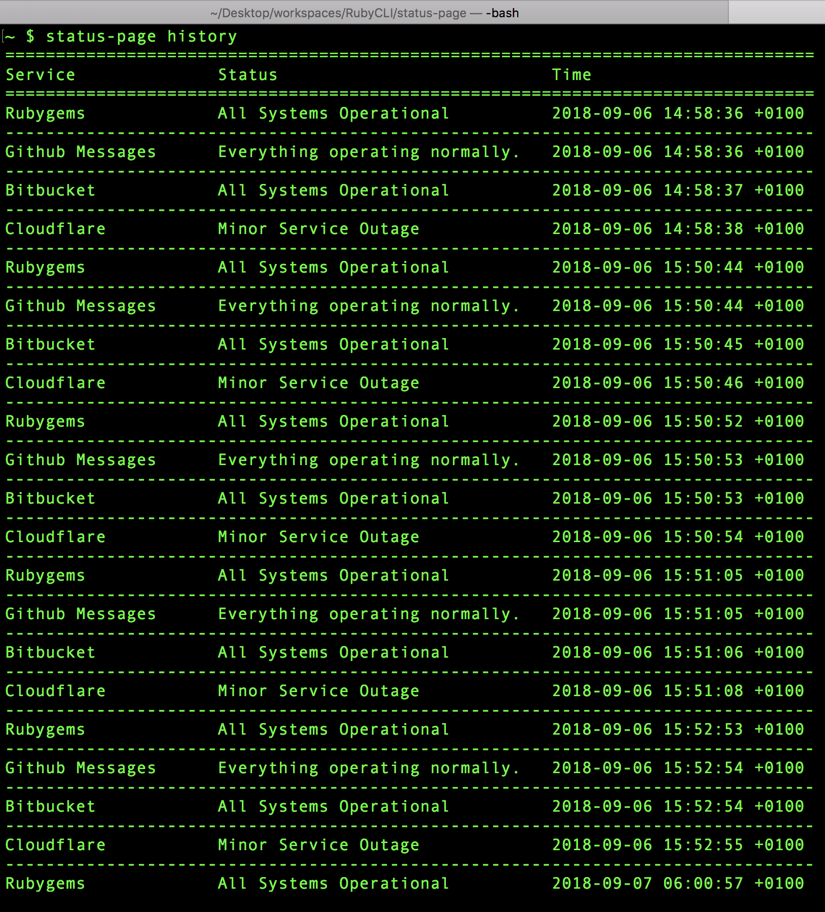
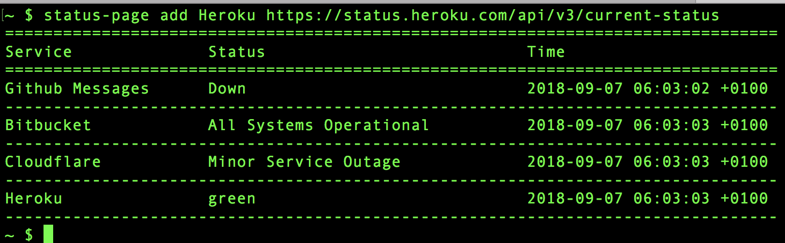
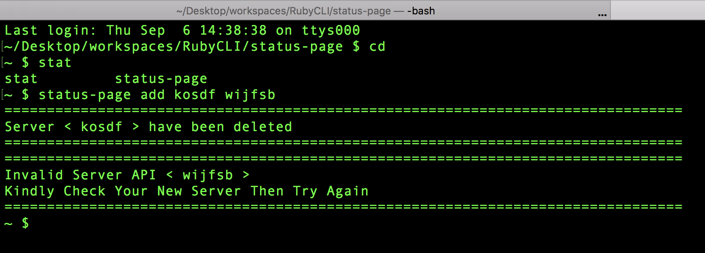
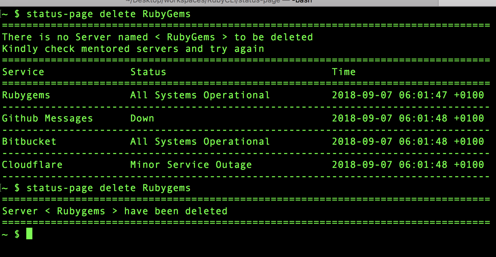
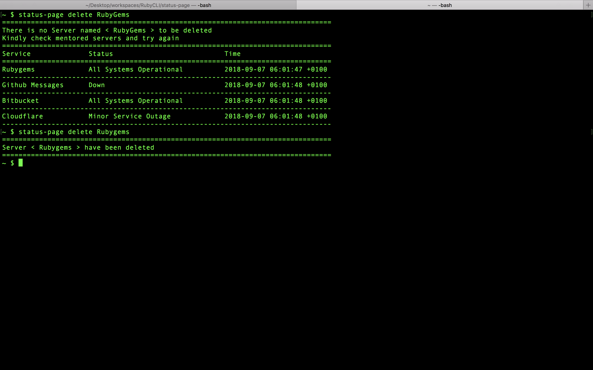

# StatusPage


## Installation Local

to user Locally within it's directory

```sh
  bundle install
```

## Test

```sh
  rake spec
```


## Usage

  Using within local Directory run

```sh
  bundle exec exe/status-page hello yourname
  bundle exec exe/status-page pull
  bundle exec exe/status-page live
  bundle exec exe/status-page history
  bundle exec exe/status-page backup <Directory path for history backup>
  bundle exec exe/status-page restore <Full Path for history restore file>
  bundle exec exe/status-page add <Server name> <Server API>
  bundle exec exe/status-page delete <Server name>
```

Usage form anywhere run first

```
  rake install
```

```sh
  status-page hello yourname
```

```sh
  status-page pull
```


```sh
  status-page live
```


```sh
  status-page history
```


```sh
  status-page backup <Directory path for history backup>
```

```sh
  status-page restore <Full Path for history restore file>
```

```sh
  status-page add <Server name> <Server API>
```





```sh
  status-page delete <Server name>
```





## Installation After Release

Add this line to your application's Gemfile:

```sh
gem "status-page"
```

And then execute:

```sh
$ bundle
```

Or install it yourself as:

```sh
$ gem install status-page
```

## Contributing

1. Fork it
2. Create your feature branch (`git checkout -b my-new-feature`)
3. Commit your changes (`git commit -am "Add some feature"`)
4. Push to the branch (`git push origin my-new-feature`)
5. Create new Pull Request
